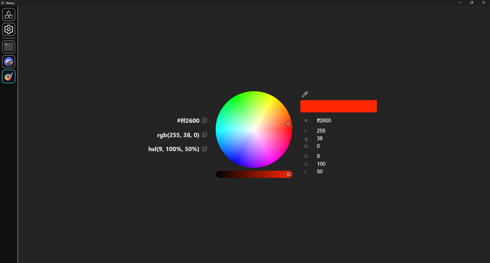

# [Nexus](https://github.com/aarontburn/nexus-core): Color Picker

A simple and minimalistic color picker for Nexus.

  

## Installation
1. Download the latest release `.zip`. 
2. In Nexus, navigate to **Settings** > **Import Module**
3. Select the downloaded `.zip` file to install.

## Features
- **Quick Copy**: Quickly copy the color in the desired format (hex, rgb, hla) by clicking the colors on the left of the picker.
- **Screen Eyedropper**: Get the color of a pixel on your screen.
- **Manual Input**: Manually set the fields on the right of the color picker.